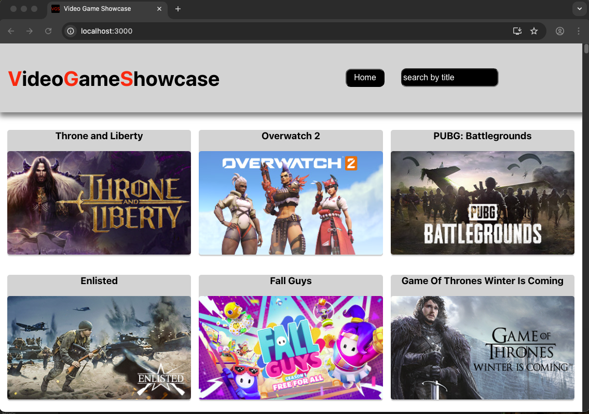
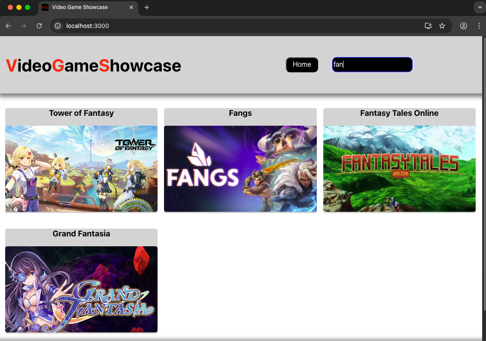
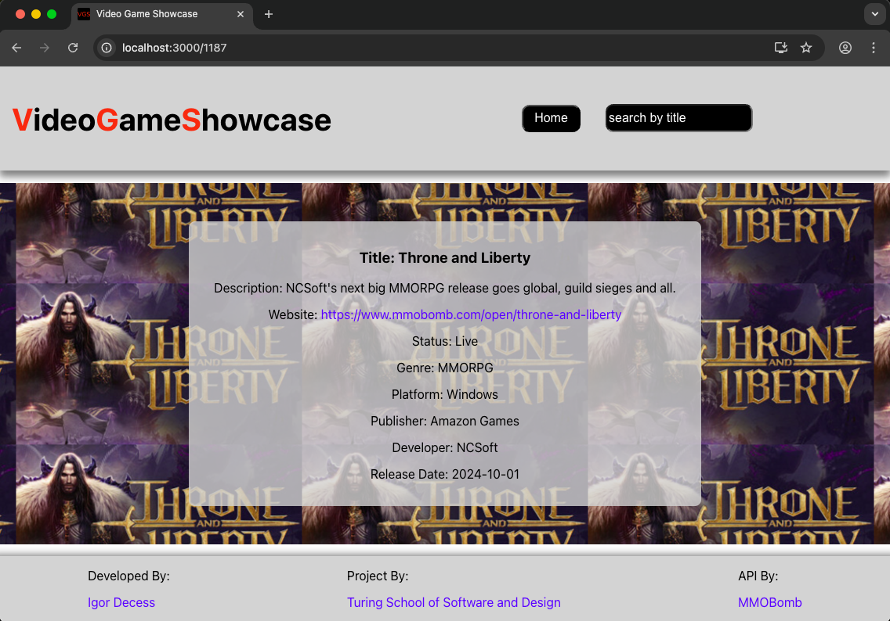

# Video Game Showcase

## Table of Contents
- [Contributors](#contributors)
- [Introduction](#introduction)
- [Technologies](#technologies)
- [Deployed Link](#deployed-link)
- [Learning Goals](#learning-goals)
- [Features](#features)
- [Project Demo](#project-demo)
- [Future Extensions](#possible-future-extensions)
- [Set Up](#set-up-instructions)
- [Project Spec](#project-spec)
- [Additional Resources](#additional-resources)

## Contributors
[Igor Decess](https://github.com/userigorgithub)

## Introduction
Find an amazing MMO (massively multiplayer online) game and read information about it! No time to scroll through all games? Use search feature to find that game faster. What is your favorite game?

Video Game Showcase was a solo project of [Turing School of Software and Design](https://turing.edu/) that gave an opportunity to strengthen knowledge of React, Router, and Cypress E2E testing.

## Technologies
- React
- Router
- JavaScript
- HTML
- CSS
- Cypress
- Fetch API
- NPM
- Vercel

## Deployed Link
- Deployed application right [HERE](https://video-game-showcase.vercel.app/)!

## Learning Goals
- Learning how to use React and Router libraries
- Learning how to use Cypress end-to-end testing library

## Features
- Upon page load, the user will be presented with many MMO games
- A user can search for a specific game
- When user clicks on a game, they are taken to a page with that game
- Users can read the details of a game
- Users can utilize the forward/backward arrows to navigate their history on the site and can share a specific URL pertaining to each game
- Go to the top button when user scrolls down
- Responsive design when using a laptop, tablet, or phone

## Project Demo

Home page:

Search feature:

Game Details page:

## Possible Future Extensions
- Create filtering functionality by MMO game type
- Being able to favorite games
- Inputing comments for each game

## Set Up Instructions
1. Fork and clone [this](https://github.com/userigorgithub/video-game-showcase) repo
2. Type `cd video-game-showcase` to move into the root directory
3. Run `npm install` to install necessary dependencies
4. Run `npm start`
5. Copy the url given by running `npm start` and copy it to your browser
6. Explore the available games and see their details!

## Project Spec
- The spec for this project can be found [here](https://frontend.turing.edu/projects/module-3/showcase.html)

## Additional Resources
- API was provided by [MMOBomb](https://www.mmobomb.com/api)
